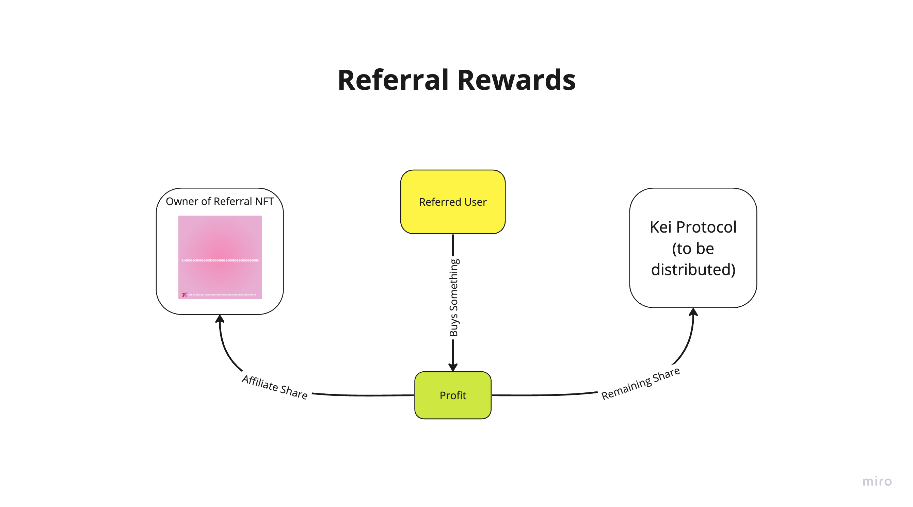

# Unstake Penalty


It is important to understand the penalties associated with unstaking before the designated stake end date. This is to ensure that you do not have any unexpected losses.


The unstake penalty is applied when you are unstaking your tokens before the designated _Stake Duration_. It applies to both the principal and the rewards earned, and is in place to incentivise people to hold their tokens and continue to stake for longer durations.&#x20;

All penalty tokens that are subtracted from the unstake amount, are then returned into the staking pool directly as rewards. So this creates a feedback cycle for those that decide to stake for long durations, and hold.&#x20;

### Current Penalty

| Property    |     |
| ----------- | --- |
| Min Penalty | 0   |
| Max Penalty | 100 |

### Penalty Curve

### Formula

The formula associated with what penalty you receive is calculated as such:

| Variable | Value                      |
| -------- | -------------------------- |
| a        | Min Penalty                |
| b        | Max Penalty                |
| c        | Current Stake Duration (%) |
| x        | Unstake Penalty (%)        |

$$
f(x) = b - (c^2 * (b - a))
$$

