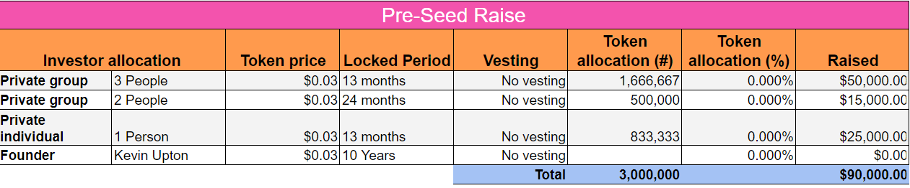
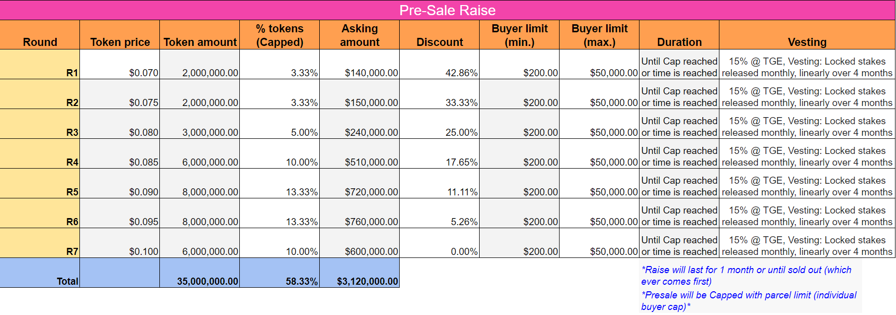

# Fundraising

## Complete: Private Round - Pre-Seed Raise

<figure><figcaption></figcaption></figure>

## Upcoming

### Public Round - Presale

<figure><figcaption></figcaption></figure>

### **Investment Offer Informative Note**

**KEI Finances is pleased to announce a unique investment opportunity in its upcoming presale of its utility token, $KEI.**

### Presale Mechanics & Structure

Our unique pricing structure and Presale mechanics promise significant benefits to early participants, with enduring value guaranteed for those who join us later on in the journey. The post-Token Generation Event (TGE) release plan, designed with a meticulous unlocking and vesting schedule, exemplifies our commitment to long-term, sustainable value creation..

The Presale will consist of seven pricing levels, starting from $0.07 per token (a 42.8% discount) to $0.10 per token (price at listing). The earlier you join, the higher the discount.

Here's the highlight: even with a top-tier pricing of $0.10 per token, we've set Kei Finance's valuation with remarkable modesty. This deliberate decision mirrors our unwavering commitment to maintaining integrity and fostering enduring value, as opposed to pursuing transient financial gains.\

#### **Presale Overview**

* The presale will commence on the 29th of August and will run until the 26th of September on our website.
* The presale will feature 7 price levels, from $0.07 with a 42.8% discount, up to $0.10 with no discount.
* The minimum purchase is set at $200 and the maximum purchase at $50,000.
* Our objective is to sell 58.33% of the initial total token supply to raise $3.24 million at the optimal cap, valuing our organization at $6 million FDV.
* Token Generation Event (TGE) price will be $0.10 with 20% of the initial total token supply allocated to the initial liquidity pool.

#### **Presale Stages**

* The stages of the presale are designed to incentivize early participation, with smaller percentages of token allocation offered at the lowest token price.
  * For example, at $0.07 there will be 3% of tokens on offer, whereas at $0.9 there will be 13.3% of tokens on offer.
* However, it's important to reassure that even the TGE price of $0.10 represents a significant value, as we've valued our organization modestly, setting the stage for positive price discovery upon TGE.

#### **Token Distribution & Staking**

* At TGE, 15% of the tokens will be immediately available, with the remaining tokens divided into four locked staking positions set a month apart, to create a locked vesting distribution over four months.
  * For example, 15% on TGE, and then an e-NFT with 21.25% of tokens, locked for 30 days, then 21.25% of tokens locked for 60 days, then 90 days and finally for 120 days.
* This unique structure allows investors to engage with our platform even during their vesting period, through trading their stakes on our e-NFT marketplace and playing with our K-diversiFI.

By participating in the $KEI presale, investors not only access a utility token at a discounted price but also get a chance to be part of a forward-looking fintech platform.

Please remember that investments in crypto-assets involve risks, including the loss of all capital. Always invest wisely and within your risk tolerance.

For more information on this offer, please visit our website or contact our team directly.&#x20;
